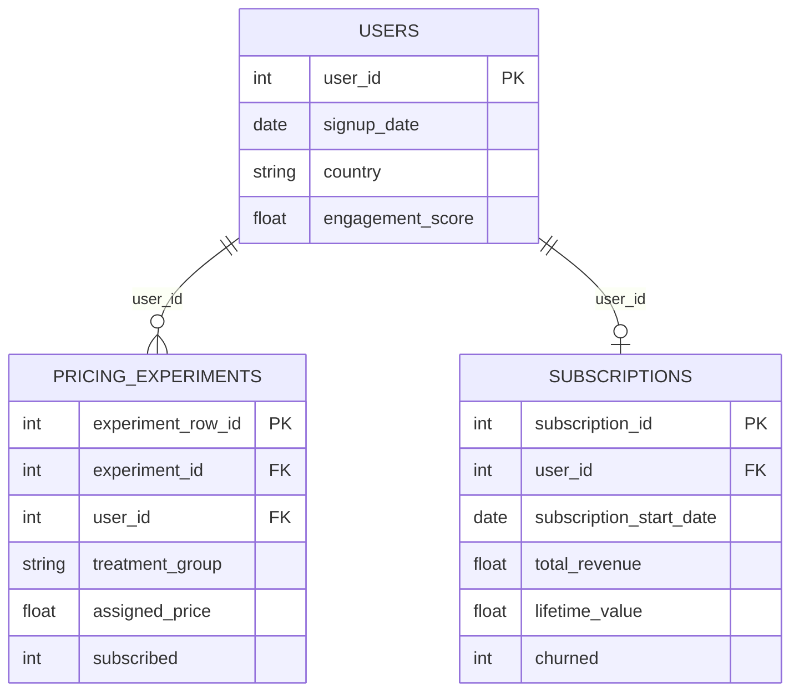

# Data schema — Subscription pricing experiment (synthetic)

This document describes the **logical data model** exported to `output/*.csv`. Latent variables exist only inside `src/simulation.py` and are listed in a separate subsection for traceability.

---

## ERD (conceptual)

---

## Primary keys

| Table | Primary key | Notes |
|-------|-------------|--------|
| `users` | `user_id` | Surrogate; stable user identifier. |
| `pricing_experiments` | `experiment_row_id` | Log-row id. **Not** unique on `user_id` when duplicate logging is enabled. |
| `subscriptions` | `subscription_id` | One record per subscriber in this simulator (no multi-sub history). |

---

## Foreign keys & relationships

| Child table | Column | Parent table | Parent key | Cardinality |
|-------------|--------|--------------|------------|-------------|
| `pricing_experiments` | `user_id` | `users` | `user_id` | Many rows per user allowed (duplicates). Typical: one “real” row per user + rare dupes. |
| `subscriptions` | `user_id` | `users` | `user_id` | Zero or one rows per user for the default generator. |

---

## Grain definition

- **`users`**: one row per **registered account** in the simulation cohort.  
- **`pricing_experiments`**: one row per **experiment logging event** at the pricing surface (assignment + funnel outcomes). Most users have a single row; a small fraction may have **duplicate rows** with the same `experiment_id` / `user_id` to mimic ETL double-writes. Analytics should **deduplicate** on `user_id` (e.g. `min(experiment_row_id)`) when computing per-user conversion.  
- **`subscriptions`**: one row per **subscription instance** — in this project, at most one per user (single conversion path).

---

## Treatment & time assumptions

- Users are **randomly assigned** among `control`, `variant_mid`, and `variant_high` with fixed list prices and cohort-level discounts (see `data_dictionary.md`).  
- `experiment_date` is on or shortly after `signup_date` (pricing moment in the funnel).  
- Subscription financial time is **monthly buckets**; `months_active` is a discrete count (geometric survival capped at `max_subscription_months` in config).  
- `subscription_end_date` is null when `churned = 0` (still active at horizon cap).

---

## Omitted / latent variables

The following are **generated in code** and influence conversion, churn, revenue, and observed proxies, but are **excluded from all CSV exports**:

| Name | Role |
|------|------|
| `willingness_to_pay` | Latent monthly WTP (USD scale). |
| `price_sensitivity` | Standardized elasticity driver. |
| `intrinsic_engagement` | True engagement; drives noisy `engagement_score`. |
| `latent_brand_affinity` | Loyalty driver for funnel and churn. |

See `README.md` for confounding / RCT discussion.

---

## Assumptions & limitations

1. **Single experiment wave** — `experiment_id` is constant in the default generator.  
2. **No multi-region price lists** — currency is mostly USD with a small EUR mix for noise.  
3. **Simplified subscription history** — upgrades/downgrades and multiple sequential subs are not modeled.  
4. **Duplicate rows** — intentional; real-world event pipelines emit duplicates; analysts must handle grain.  
5. **Scalability** — generation is vectorized; very large `n_users` require sufficient RAM for dense float arrays.
